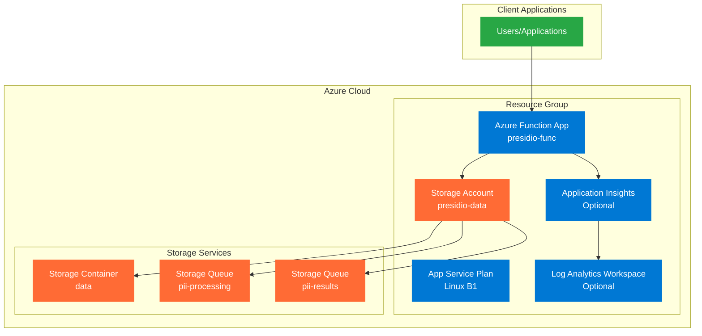

# Presidio PII Detection Service

A serverless Azure Functions application for detecting Personally Identifiable Information (PII) in text and documents using Microsoft Presidio. The application provides HTTP endpoints for PII analysis and health monitoring.

## 🏗️ Architecture



## 🔧 Services Used

- **Azure Functions**: Serverless compute platform hosting the PII detection service
- **Azure Storage Account**: Blob storage for documents and queues for processing
- **App Service Plan**: Linux-based hosting plan for the Function App
- **Application Insights** (Optional): Application performance monitoring and logging
- **Log Analytics Workspace** (Optional): Centralized logging and analytics
- **Microsoft Presidio**: Open-source PII detection and anonymization library

## 📁 Project Structure

```
presidio/
├── app/                          # Application code
│   ├── deploy.sh                 # Deployment script
│   ├── run_tests.sh             # Test execution script
│   ├── function_app/            # Azure Function App
│   │   ├── function_app.py      # Main function code
│   │   ├── requirements.txt     # Python dependencies
│   │   ├── host.json           # Function app configuration
│   │   └── local.settings.json # Local development settings
│   └── tests/                   # Test files
└── infra/                       # Infrastructure as Code
    ├── main.tf                  # Main Terraform configuration
    ├── variables.tf             # Variable definitions
    ├── outputs.tf               # Output definitions
    ├── sa.tf                    # Storage account resources
    ├── appins.tf               # Application Insights resources
    ├── rbac.tf                 # Role-based access control
    ├── terraform.tfvars.example # Example configuration
    └── README.md               # Infrastructure documentation
```

## 📋 Prerequisites

### Required Tools
- **Azure CLI** - Install from [Microsoft Docs](https://docs.microsoft.com/en-us/cli/azure/install-azure-cli)
- **Terraform** (>= 1.0) - Install from [terraform.io](https://www.terraform.io/downloads.html)
- **Azure Functions Core Tools** (v4) - Install with npm:
  ```bash
  npm install -g azure-functions-core-tools@4 --unsafe-perm true
  ```
- **Python** (3.12 or 3.13) - Recommended for local development
- **jq** - For JSON processing in deployment scripts

### Azure Prerequisites
- Azure subscription with appropriate permissions
- Existing Azure resource group (default: "personal")
- Azure CLI authentication: `az login`

## 🚀 Deployment Guide

### Step 1: Deploy Infrastructure

1. **Navigate to infrastructure directory:**
   ```bash
   cd infra
   ```

2. **Initialize Terraform:**
   ```bash
   terraform init
   ```

3. **Create configuration file:**
   ```bash
   cp terraform.tfvars.example terraform.tfvars
   ```

4. **Edit terraform.tfvars with your values:**
   ```hcl
   resource_group_name = "your-resource-group"
   location = "Australia East"
   project_name = "presidio"
   app_service_plan_sku = "B1"
   python_version = "3.12"
   enable_application_insights = true
   ```

5. **Plan the deployment:**
   ```bash
   terraform plan
   ```

6. **Apply the infrastructure:**
   ```bash
   terraform apply
   ```

   When prompted, type `yes` to confirm the deployment.

### Step 2: Deploy Application

1. **Navigate to application directory:**
   ```bash
   cd ../app
   ```

2. **Make deployment script executable:**
   ```bash
   chmod +x deploy.sh
   ```

3. **Deploy the function app:**
   ```bash
   ./deploy.sh [resource-group-name] [function-app-name]
   ```

   Example:
   ```bash
   ./deploy.sh personal presidio-func
   ```

   The script will:
   - Validate prerequisites
   - Configure app settings
   - Deploy the function code
   - Test the endpoints

## 🔗 API Endpoints

After successful deployment, the following endpoints will be available:

### Health Check
```
GET https://{function-app-name}.azurewebsites.net/api/health
```

Response:
```json
{
  "status": "healthy",
  "timestamp": "2025-07-23T10:30:00.000Z"
}
```

### PII Analysis
```
GET https://{function-app-name}.azurewebsites.net/api/pii/analysis/{container_name}/{blob_name}
```

Example:
```
GET https://presidio-func.azurewebsites.net/api/pii/analysis/data/document.txt
```

### Hello World (Test Endpoint)
```
GET https://{function-app-name}.azurewebsites.net/api/hello
```

### Diagnostics
```
GET https://{function-app-name}.azurewebsites.net/api/diagnostics
```

## 🧪 Testing

Run the test suite:
```bash
cd app
chmod +x run_tests.sh
./run_tests.sh
```

## 🛠️ Local Development

1. **Set up Python environment:**
   ```bash
   cd app/function_app
   python -m venv venv
   source venv/bin/activate  # On Windows: venv\Scripts\activate
   pip install -r requirements.txt
   ```

2. **Configure local settings:**
   ```bash
   cp local.settings.json.example local.settings.json
   # Edit local.settings.json with your Azure Storage connection strings
   ```

3. **Start the function app locally:**
   ```bash
   func start
   ```

## 📊 Monitoring

When Application Insights is enabled, you can monitor:
- Function execution metrics
- Error rates and exceptions
- Performance metrics
- Custom telemetry

Access monitoring through:
- Azure Portal → Application Insights
- Log Analytics queries
- Azure Monitor dashboards

## 🔧 Configuration

### Infrastructure Configuration (terraform.tfvars)
- `resource_group_name`: Target Azure resource group
- `location`: Azure region for deployment
- `project_name`: Prefix for resource names
- `app_service_plan_sku`: Compute tier (B1, B2, B3, S1, S2, S3, P1v2, P2v2, P3v2)
- `python_version`: Python runtime version (3.11, 3.12)
- `enable_application_insights`: Enable monitoring (true/false)

### Application Configuration
Function app settings are automatically configured during deployment, including:
- Storage account connections
- Queue configurations
- Presidio settings
- Runtime configurations

## 🗑️ Cleanup

To remove all deployed resources:

```bash
cd infra
terraform destroy
```

When prompted, type `yes` to confirm resource deletion.

## 🤝 Contributing

1. Fork the repository
2. Create a feature branch
3. Make your changes
4. Add tests for new functionality
5. Submit a pull request

## 📝 License

This project is licensed under the MIT License - see the LICENSE file for details.

## 🔍 Troubleshooting

### Common Issues

1. **Deployment fails with authentication error:**
   - Run `az login` to authenticate with Azure
   - Verify you have the correct permissions

2. **Function app not starting:**
   - Check Application Insights logs
   - Verify Python runtime version compatibility
   - Check storage account connection strings

3. **Terraform apply fails:**
   - Ensure resource group exists
   - Check Azure subscription limits
   - Verify Terraform version compatibility

4. **Local development issues:**
   - Ensure Azure Functions Core Tools v4 is installed
   - Check local.settings.json configuration
   - Verify Python virtual environment is activated

### Support

For issues and questions:
- Check the [Issues](../../issues) section
- Review Azure Functions documentation
- Consult Presidio documentation


## TODO

- Decouple this by:
  - Adding Queues
  - Separate process for trigger
  - Separate process for the analyzer, maybe using the MS default image https://microsoft.github.io/presidio/samples/deployments/app-service/ - curl -d '{"text":"John Smith drivers license is AC432223", "language":"en"}' -H "Content-Type: application/json" -X POST http://localhost:3000/analyze